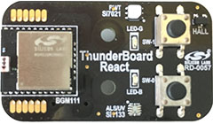
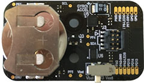
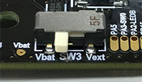
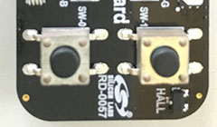
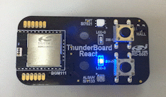

node-thunderboard-react
===============

The node-thunderboard-react is a Node.js module which allows you to communicate with The [Thunderboard React Board Kit](http://www.silabs.com/products/wireless/pages/thunderboard-react-kit-sensor-cloud-connectivity.aspx) sold by Silicon Laboratories.




This module exposes the APIs which allows you to access the Thunderboard React via BLE easily. This module is based on the document "[UG164: ThunderboardTM React (RD-0057-0201) User's Guide](http://www.silabs.com/Support%20Documents/TechnicalDocs/UG164-ThunderBoard-React.pdf)" published by Silicon Laboratories.

The node-thunderboard-react provides you with the APIs as follows:

* Discovery the Thunderboard React Board Kit(s)
* Access the all services supported by the Thunderboard React Board Kit as follows:
	* Device Information Service
	* Battery Service
	* Environmental Sensing Service
	* Ambient Light Service
	* Cycling Speed and Cadence Service
	* Acceleration and Orientation Service
	* Automation IO Service (partially)

## Dependencies
- [Node.js](https://nodejs.org/en/) 4.4 +
- [noble](https://www.npmjs.com/package/noble)

## Installation
```
$ npm install node-thunderboard-react
```
---------------------------------------
## Table of Contents
* [Operating suggestions](#Operating-suggestions)
* [Quick Start](#Quick-Start)
	* [Reading the sensor data](#Quick-Start-1)
	* [Monitoring the sensor data](#Quick-Start-2)
	* [Setting data](#Quick-Start-3)
* [`ThunderboardReact` object](#ThunderboardReact-object)
	* [Constructor](#ThunderboardReact-constructor)
	* [Methods](#ThunderboardReact-methods)
		* [`init(callback)` method](#init-method)
		* [`startDiscovery(callback)` method](#startDiscovery-method)
		* [`stopDiscovery()` method](#stopDiscovery-method)
* [`ThunderboardReactDevice` object](#ThunderboardReactDevice-object)
	* [Methods](#ThunderboardReactDevice-methods)
		* [`connect([callback])` method](#connect-method)
		* [`disconnect([callback])` method](#disconnect-method)
		* [`getManufacturerName(callback)` method](#getManufacturerName-method)
		* [`getModelNumber(callback)` method](#getModelNumber-method)
		* [`getFirmwareRevision(callback)` method](#getFirmwareRevision-method)
		* [`getSystemId(callback)` method](#getSystemId-method)
		* [`getDeviceInfo(callback)` method](#getDeviceInfo-method)
		* [`getBatteryLevel(callback)` method](#getBatteryLevel-method)
		* [`startMonitorBatteryLevel([callback])` method](#startMonitorBatteryLevel-method)
		* [`stopMonitorBatteryLevel([callback])` method](#stopMonitorBatteryLevel-method)
		* [`getHumidity(callback)` method](#getHumidity-method)
		* [`getTemperature(callback)` method](#getTemperature-method)
		* [`getUvIndex(callback)` method](#getUvIndex-method)
		* [`getEnvironmentalSensing(callback)` method](#getEnvironmentalSensing-method)
		* [`getAmbientLight(callback)` method](#getAmbientLight-method)
		* [`startMonitorCsc([callback])` method](#startMonitorCsc-method)
		* [`stopMonitorCsc([callback])` method](#stopMonitorCsc-method)
		* [`startMonitorAcceleration([callback])` method](#startMonitorAcceleration-method)
		* [`stopMonitorAcceleration([callback])` method](#stopMonitorAcceleration-method)
		* [`startMonitorOrientation([callback])` method](#startMonitorOrientation-method)
		* [`stopMonitorOrientation([callback])` method](#stopMonitorOrientation-method)
		* [`getLedStatus(callback)` method](#getLedStatus-method)
		* [`setLedStatus(callback)` method](#setLedStatus-method)
		* [`getSwitchStatus(callback)` method](#getSwitchStatus-method)
		* [`startMonitorSwitchStatus([callback])` method](#startMonitorSwitchStatus-method)
		* [`stopMonitorSwitchStatus([callback])` method](#stopMonitorSwitchStatus-method)
	* [Events](#ThunderboardReactDevice-events)
		* [`connect` event](#connect-event)
		* [`disconnect` event](#disconnect-event)
		* [`battery` event](#battery-event)
		* [`csc` event](#csc-event)
		* [`acceleration` event](#acceleration-event)
		* [`orientation` event](#orientation-event)
		* [`switch` event](#switch-event)
* [License](#License)

---------------------------------------
## <a name="Operating-suggestions"> Operating suggestions</a>

When you use the Thunderboard React Board Kit, don't forget turn it on. Be sure that the SW3 is set to "Vbat".



Besides, before the discovery process is about to start, be sure to press a button (ether SW0 or SW1). Once the button is pressed, the Thunderboard React Board Kit send advertising packets for 30 seconds.



---------------------------------------
## <a name="Quick-Start"> Quick Start</a>

This section shows how to discover Thunderboard React Board Kit(s), how to get a sensor value the device, and how to set a value to the device.

### <a name="Quick-Start-1"> Reading the sensor data </a>

This sample code shows how to read the Environmental Sensing data (humidity, temperature, UV index).

```JavaScript
// Create a ThunderboardReact object
var ThunderboardReact = require('node-thunderboard-react');
var thunder = new ThunderboardReact();

// Initialize the ThunderboardReact object
thunder.init((error) => {
  // Discover the Thunderboard React Board Kit
  thunder.startDiscovery((device) => {
    console.log('- Found ' + device.localName);
    // Stop the discovery process
    thunder.stopDiscovery();
    // Connect to the found device
    device.connect((error) => {
      console.log('- Connected ' + device.localName);
      // Get the sensored data
      getEnvironmentalSensing(device);
    });
  });
});

// Get the sensored data
function getEnvironmentalSensing(device) {
  device.getEnvironmentalSensing((error, res) => {
    // Show the data
    console.log('- Sensored data:');
    console.log('  - Humidity    : ' + res.humidity + ' %');
    console.log('  - Temperature : ' + res.temperature + ' °C');
    console.log('  - UV Index    : ' + res.uvIndex);
    // Disconnect the device
    device.disconnect(() => {
      console.log('- Disconnected ' + device.localName);
      process.exit();
    });
  });
}
```

This sample code will output the result like this:

```
- Found Thunder React #28932
- Connected Thunder React #28932
- Sensored data:
  - Humidity    : 50.18 %
  - Temperature : 26.65 °C
  - UV Index    : 0
- Disconnected Thunder React #28932
```

### <a name="Quick-Start-2"> Monitoring the sensor data </a>

This sample code shows how to monitor the sensor data incoming from the device. In this code, the orientation of the device is monitored.

```JavaScript
var ThunderboardReact = require('../lib/node-thunderboard-react.js');
var thunder = new ThunderboardReact();

thunder.init((error) => {
  thunder.startDiscovery((device) => {
    console.log('- Found ' + device.localName);
    thunder.stopDiscovery();
    device.connect((error) => {
      console.log('- Connected ' + device.localName);
      startMonitorOrientation(device);
    });
  });
});

// Monitor the sensored data
function startMonitorOrientation(device) {
  // Start to monitor the orientation of the device
  device.startMonitorOrientation((error) => {
    if(error) {
      console.log(error.toString());
      process.exit();
    }
  });

  // Set a listener for orientation events fired on the ThunderboardReactDevice object
  device.on('orientation', (res) => {
    // Show the event data
    console.log('- Orientation:');
    console.log('  - alpha :' + res.alpha + '°');
    console.log('  - beta  :' + res.beta + '°');
    console.log('  - gamma :' + res.gamma + '°');
  });

  // Stop to monitor and disconnect the device in 5 seconds
  setTimeout(() => {
    device.stopMonitorOrientation((error) => {
      // Disconnect the device
      device.disconnect(() => {
        console.log('- Disconnected ' + device.localName);
        process.exit();
      });
    });
  }, 5000);
}
```

This sample code will output the result like this:

```
- Found Thunder React #28932
- Connected Thunder React #28932
- Orientation:
  - alpha :3.26°
  - beta  :-0.45°
  - gamma :-26.52°
- Orientation:
  - alpha :-19.47°
  - beta  :-25.4°
  - gamma :-82.63°

...

- Disconnected Thunder React #28932
```

### <a name="Quick-Start-3"> Setting data </a>

This sample code shows how to set data to he device. This code turns on and off the two LEDs on the device one after the other every 500 milliseconds.

```JavaScript
var ThunderboardReact = require('node-thunderboard-react');
var thunder = new ThunderboardReact();

thunder.init((error) => {
  thunder.startDiscovery((device) => {
    console.log('- Found ' + device.localName);
    thunder.stopDiscovery();
    device.connect((error) => {
      // Turn on/off the LEDs
      turnOnOffLeds(device, true);
    });
  });
});

// Turn on/off the LEDs
function turnOnOffLeds(device, flag) {
  // Send a message for Turning on/off the LEDs
  var status = {'led0': flag, 'led1': !flag};
  device.setLedStatus(status, (error) => {
    // Recall this method in 500 ms
    setTimeout(() => {
      turnOnOffLeds(device, !flag);
    }, 500);
  });
}
```

You will see the device like this:



---------------------------------------
## <a name="ThunderboardReact-object"> ThunderboardReact object</a>

### <a name="ThunderboardReact-constructor"> Constructor</a>

In order to use the node-thunderboard-react, you have to load the node-thunderboard-react module as follows:

```JavaScript
var ThunderboardReact = require('node-thunderboard-react');
```

You can get an `ThunderboardReact` constructor using the code above. Then you have to create an `ThunderboardReact` object as an instance of the `ThunderboardReact` constructor as follows:

```JavaScript
var thunder = new ThunderboardReact();
```

The `ThunderboardReact` constructor takes an argument optionally. It must be a hash object having the properties as follows:

Property | Type   | Required | Description
:--------|:-------|:---------|:-----------
`noble`  | Noble  | option   | a Noble object of the [`noble`](https://www.npmjs.com/package/noble) module

The node-thunderboard-react module uses the [`noble`](https://www.npmjs.com/package/noble) module in order to interact with the Thunderboard React(s) on BLE. If you want to interact other BLE devices using the noble module, you can create an `Noble` object by yourself, then pass it to this module. If you don't specify a `Noble` object for the `noble` property, this module automatically create a `Noble` object internally.

The sample code below shows how to pass a `Nobel` object to the `ThunderboardReact` constructor.

```JavaScript
// Create a Noble object
var noble = require('noble');

// Create a ThunderboardReact object
var ThunderboardReact = require('node-thunderboard-react');
var thunder = new ThunderboardReact({'noble': noble});
```

### <a name="ThunderboardReact-methods"> Methods</a>

This section describes the methods implemented in the `ThunderboardReact` object.

#### <a name="init-method"> init(*callback*)</a>

This method initializes the `ThunderboardReact` object. You have to initialize the `ThunderboardReact` object immediately after you create it.

The initialization is processed asynchronously. Therefore you have to specify a callback function as the 1st argument of this method.

```JavaScript
// Create a ThunderboardReact object
var ThunderboardReact = require('node-thunderboard-react');
var thunder = new ThunderboardReact();

// Initialize the ThunderboardReact object
thunder.init((error) => {
	if(error) { // An error was occurred
    // Do something for the error.
  } else { // The initialization process completed successfully
    // Do something using the ThunderboardReact object.
    // Generally, the discover process is started here.
  }
});
```

#### <a name="startDiscovery-method"> startDiscovery(*callback*)</a>

This method starts the discovery process and tries to find the Thunderboard React devices. Whenever a Thunderboard React device was found, the `callback` function specified to the 1st argument will be called.

When a device was found, the `callback` will be passed a [`ThunderboardReactDevice`](#ThunderboardReactDevice-object) object as the 1st argument. See the section "[`ThunderboardReactDevice` object](#ThunderboardReactDevice-object)" in details.

```JavaScript
var ThunderboardReact = require('node-thunderboard-react');
var thunder = new ThunderboardReact();

thunder.init((error) => {
  // Discover the Thunderboard React Board Kit
  thunder.startDiscovery((device) => {
    console.log('- Found ' + device.localName);
    // Stop the discovery process
    thunder.stopDiscovery();
		// Do something with the device.
		// Generally, the device should be connected here.
  });
});
```

#### <a name="stopDiscovery-method"> stopDiscovery()</a>

This method stop the discovery process. If the `startDiscovery()` method was called and the targeted device was found, then be sure to call this method before controlling the targeted devices.

---------------------------------------
## <a name="ThunderboardReactDevice-object"> ThunderboardReactDevice object</a>

The `ThunderboardReactDevice` represents a Thunderboard React device. This object can be obtain through the discover process using the [`startDiscovery()`](#ThunderboardReact-startDiscovery-method) method on the [`ThunderboardReact`](#ThunderboardReact-object) object.

This section describes the methods implemented in the `ThunderboardReactDevice` object and the events fired on the `ThunderboardReactDevice` object.

### <a name="ThunderboardReactDevice-methods"> Methods</a>

#### <a name="connect-method"> connect(*[callback]*)</a>

This method tries to confirm a connection with the device which the `ThunderboardReactDevice` object represents. If the devcie was connected successfully, the `callback` specified as the 1st argument will be called. The `callback` is optional.

```JavaScript
// Create a ThunderboardReact object
var ThunderboardReact = require('../lib/node-thunderboard-react.js');
var thunder = new ThunderboardReact();

// Initialize the ThunderboardReact object
thunder.init((error) => {
  // Discover the Thunderboard React Board Kit
  thunder.startDiscovery((device) => {
    console.log('- Found ' + device.localName);
    // Stop the discovery process
    thunder.stopDiscovery();
    // Connect to the found device
    device.connect((error) => {
      console.log('- Connected ' + device.localName);
      // Do something with the device
			...
    });
  });
});
```

After the connection has been confirmed, you can interact with the device using a lot of methods implemented on the `ThunderboardReactDevice` object described blow.

#### <a name="disconnect-method"> disconnect(*[callback]*)</a>

This method disconnects the device. If the device was disconnected successfully, the `callback` will be called. The `callback` is optional. Once the connection is disabled, the method other than the [`connect`](#connect-method) method won't work any more. If you want to interact with the same device again, call the [`connect`](#connect-method) method again.

#### <a name="getManufacturerName-method"> getManufacturerName(*callback*)</a>

This method reads the Manufacturer Name from the device. When the process was completed, the `callback` will be called. The two arguments will be passed to the `callback`: the `Error` object and `Response` object. The `Response` object is a hash object having the properties as follows:

Property           | Type   | Description
:------------------|:-------|:-----------
`manufacturerName` | String | Basically, the value should be "Silicon Labs".

```JavaScript
device.getManufacturerName((error, res) => {
  console.log(res.manufacturerName); // "Silicon Labs"
});
```

This method reads the characteristic UUID `0x2a29` of the Device Information Service (UUID: `0x180`).

#### <a name="getModelNumber-method"> getModelNumber(*callback*)</a>

This method reads the Model Number from the device. When the process was completed, the `callback` will be called. The two arguments will be passed to the `callback`: the `Error` object and `Response` object. The `Response` object is a hash object having the properties as follows:

Property           | Type   | Description
:------------------|:-------|:-----------
`modelNumber`      | String | Basically, the value should be "RD-0057".

```JavaScript
device.getModelNumber((error, res) => {
  console.log(res.modelNumber); // "RD-0057"
});
```

This method reads the characteristic UUID `0x2a24` of the Device Information Service (UUID: `0x180`).

#### <a name="getFirmwareRevision-method"> getFirmwareRevision(*callback*)</a>

This method reads the Firmware Revision from the device. When the process was completed, the `callback` will be called. The two arguments will be passed to the `callback`: the `Error` object and `Response` object. The `Response` object is a hash object having the properties as follows:

Property           | Type   | Description
:------------------|:-------|:-----------
`firmwareRevision` | String | e.g. "1.0.0"

```JavaScript
device.getFirmwareRevision((error, res) => {
  console.log(res.firmwareRevision); // "1.0.0"
});
```

This method reads the characteristic UUID `0x2a26` of the Device Information Service (UUID: `0x180`).

#### <a name="getSystemId-method"> getSystemId(*callback*)</a>

This method reads the System ID from the device. When the process was completed, the `callback` will be called. The two arguments will be passed to the `callback`: the `Error` object and `Response` object. The `Response` object is a hash object having the properties as follows:

Property                   | Type   | Description
:--------------------------|:-------|:-----------
`manufacturerId`           | String | Manufacturer Identifier (e.g. "000b57fffe")
`organizationallyUniqueId` | String | Organizationally Unique Identifier (e.g. "0c7104")
`systemId`                 | String | System ID, this value is the concatenation of the `manufacturerId` and `organizationallyUniqueId` (e.g. "000b57fffe0c7104")

```JavaScript
device.getSystemId((error, res) => {
  console.log(res.manufacturerId);           // "000b57fffe"
  console.log(res.organizationallyUniqueId); // "0c7104"
  console.log(res.systemId);                 // "000b57fffe0c7104"
});
```

This method reads the characteristic UUID `0x2a23` of the Device Information Service (UUID: `0x180`).

#### <a name="getDeviceInfo-method"> getDeviceInfo(*callback*)</a>

This method reads the Manufacturer Name, the Model Number, the Firmware Revision, and the System ID (the Manufacturer Identifier and the Organizationally Unique Identifier) at a time. When the process was completed, the `callback` will be called. The two arguments will be passed to the `callback`: the `Error` object and `Response` object. The `Response` object is a hash object having the properties as follows:

Property                   | Type   | Description
:--------------------------|:-------|:-----------
`manufacturerName`         | String | Basically, the value should be "Silicon Labs".
`modelNumber`              | String | Basically, the value should be "RD-0057".
`firmwareRevision`         | String | e.g. "1.0.0"
`manufacturerId`           | String | Manufacturer Identifier (e.g. "000b57fffe")
`organizationallyUniqueId` | String | Organizationally Unique Identifier (e.g. "0c7104")
`systemId`                 | String | System ID, this value is the concatenation of the `manufacturerId` and `organizationallyUniqueId` (e.g. "000b57fffe0c7104")

```JavaScript
device.getDeviceInfo((error, res) => {
  console.log(res.manufacturerName);         // "Silicon Labs"
  console.log(res.modelNumber);              // "RD-0057"
  console.log(res.firmwareRevision);         // "1.0.0"
  console.log(res.manufacturerId);           // "000b57fffe"
  console.log(res.organizationallyUniqueId); // "0c7104"
  console.log(res.systemId);                 // "000b57fffe0c7104"
});
```

#### <a name="getBatteryLevel-method"> getBatteryLevel(*callback*)</a>

This method reads the Battery Level from the device. When the process was completed, the `callback` will be called. The two arguments will be passed to the `callback`: the `Error` object and `Response` object. The `Response` object is a hash object having the properties as follows:

Property | Type   | Description
:--------|:-------|:-----------
`level`  | Number | The battery level in units of %.

```JavaScript
device.getBatteryLevel((error, res) => {
  console.log(res.level + ' %'); // "63 %"
});
```

This method reads the characteristic UUID `0x2a19` of the Battery Service (UUID: `0x180f`).

#### <a name="startMonitorBatteryLevel-method"> startMonitorBatteryLevel(*[callback]*)</a>

This method starts to monitor the battery level notifications from the device. When this method finished the process, the `callback` will be called. A `Error` object will be passed to the `callback` as the 1st argument. If this method prepared to start monitoring successfully, the `Error` object will be `null`. The `callback` is optional.

Note that the `callback` passed to this method is not called when a notification is received. In order to get the notifications from the device, you have to set an event listener for the [`battery`](#battery-event) event fired on the `ThunderboardReactDevice` object.

```JavaScript
device.startMonitorBatteryLevel((error) => {
  if(error) {
    console.log(error.toString());
  } else {
    console.log('Started to monitor.');
  }
});

device.on('battery', (res) => {
  console.log(res.level + ' %'); // "63 %"
});

setTimeout(() => {
  device.stopMonitorBatteryLevel(() => {
    console.log('Stopped to monitor.')
  });
}, 10000);
```

#### <a name="stopMonitorBatteryLevel-method"> stopMonitorBatteryLevel(*[callback]*)</a>

This method stops to monitor the battery level notifications from the device. When this method finished the process, the `callback` will be called. A `Error` object will be passed to the `callback` as the 1st argument. If this method stops to monitor successfully, the `Error` object will be `null`. The `callback` is optional.

#### <a name="getHumidity-method"> getHumidity(*callback*)</a>

This method reads the Humidity from the device. When the process was completed, the `callback` will be called. The two arguments will be passed to the `callback`: the `Error` object and `Response` object. The `Response` object is a hash object having the properties as follows:

Property   | Type   | Description
:----------|:-------|:-----------
`humidity` | Number | The humidity as an float in units of %.

```JavaScript
device.getHumidity((error, res) => {
  console.log(res.humidity + ' %'); // "53.34 %"
});
```

This method reads the characteristic UUID `0x2a6f` of the Environmental Sensing Service (UUID: `0x181a`).

#### <a name="getTemperature-method"> getTemperature(*callback*)</a>

This method reads the Temperature from the device. When the process was completed, the `callback` will be called. The two arguments will be passed to the `callback`: the `Error` object and `Response` object. The `Response` object is a hash object having the properties as follows:

Property      | Type   | Description
:-------------|:-------|:-----------
`temperature` | Number | The temperature as an float in units of °C.

```JavaScript
device.getTemperature((error, res) => {
  console.log(res.temperature + ' °C'); // "29.9 °C"
});
```

This method reads the characteristic UUID `0x2a6e` of the Environmental Sensing Service (UUID: `0x181a`).

#### <a name="getUvIndex-method"> getUvIndex(*callback*)</a>

This method reads the UV Index from the device. When the process was completed, the `callback` will be called. The two arguments will be passed to the `callback`: the `Error` object and `Response` object. The `Response` object is a hash object having the properties as follows:

Property      | Type   | Description
:-------------|:-------|:-----------
`uvIndex`     | Number | The UV Index as an integer (unit-less)

```JavaScript
device.getUvIndex((error, res) => {
  console.log(res.uvIndex); // 1
});
```

This method reads the characteristic UUID `0x2a76` of the Environmental Sensing Service (UUID: `0x181a`).

#### <a name="getEnvironmentalSensing-method"> getEnvironmentalSensing(*callback*)</a>

This method reads the Humidity, the Temperature, and the UV Index at a time. When the process was completed, the `callback` will be called. The two arguments will be passed to the `callback`: the `Error` object and `Response` object. The `Response` object is a hash object having the properties as follows:

Property      | Type   | Description
:-------------|:-------|:-----------
`humidity`    | Number | The humidity as an float in units of %.
`temperature` | Number | The temperature as an float in units of °C.
`uvIndex`     | Number | The UV Index as an integer (unit-less)

```JavaScript
device.getEnvironmentalSensing((error, res) => {
  console.log(res.humidity + ' %');     // "53.34 %"
  console.log(res.temperature + ' °C'); // "29.9 °C"
  console.log(res.uvIndex);             // 1
});
```

#### <a name="getAmbientLight-method"> getAmbientLight(*callback*)</a>

This method reads the Ambient Light from the device. When the process was completed, the `callback` will be called. The two arguments will be passed to the `callback`: the `Error` object and `Response` object. The `Response` object is a hash object having the properties as follows:

Property | Type   | Description
:--------|:-------|:-----------
`lux`    | Number | The ambient light as an float in units of lux.

```JavaScript
device.getAmbientLight((error, res) => {
  console.log(res.lux + ' lux'); // "123.64 lux"
});
```

This method reads the characteristic UUID `0xc8546913-bfd9-45eb-8dde-9f8754f4a32e` of the Ambient Light Service (`0xd24c4f4e-17a7-4548-852c-abf51127368b`).

#### <a name="startMonitorCsc-method"> startMonitorCsc(*[callback]*)</a>

This method starts to monitor the Cycling Speed and Cadence notifications from the device. When this method finished the process, the `callback` will be called. A `Error` object will be passed to the `callback` as the 1st argument. If this method prepared to start monitoring successfully, the `Error` object will be `null`. The `callback` is optional.

Note that the `callback` passed to this method is not called when a notification is received. In order to get the notifications from the device, you have to set an event listener for the [`csc`](#csc-event) event fired on the `ThunderboardReactDevice` object. The callback for the event will be called with a `Response` object as the 1st argument whenever a notification is received. The `Response` object is a hash object having the properties as follows:

Property      | Type   | Description
:-------------|:-------|:-----------
`revolutions` | Number | Cumulative Wheel Revolutions as an integer
`time`        | Number | Last Wheel Event Time given with a resolution as an float in units of second.

```JavaScript
device.startMonitorCsc((error) => {
  if(error) {
    console.log(error.toString());
  } else {
    console.log('Started to monitor.');
  }
});

device.on('csc', (res) => {
  console.log(res.revolutions + ' revolutions in total'); // "42 revolutions in total"
  console.log(res.time + ' sec'); // "1.3017578125 sec"
});

setTimeout(() => {
  device.stopMonitorCsc(() => {
    console.log('Stopped to monitor.')
  });
}, 10000);
```

This method requests the notifications to the characteristic UUID `0x2a5b` of the Cycling Speed and Cadence Service (`0x1816`).

#### <a name="stopMonitorCsc-method"> stopMonitorCsc(*[callback]*)</a>

This method stops to monitor the Cycling Speed and Cadence notifications from the device. When this method finished the process, the `callback` will be called. A `Error` object will be passed to the `callback` as the 1st argument. If this method stops to monitor successfully, the `Error` object will be `null`. The `callback` is optional.

#### <a name="startMonitorAcceleration-method"> startMonitorAcceleration(*[callback]*)</a>

This method starts to monitor the Acceleration notifications from the device. When this method finished the process, the `callback` will be called. A `Error` object will be passed to the `callback` as the 1st argument. If this method prepared to start monitoring successfully, the `Error` object will be `null`. The `callback` is optional.

Note that the `callback` passed to this method is not called when a notification is received. In order to get the notifications from the device, you have to set an event listener for the [`acceleration`](#acceleration-event) event fired on the `ThunderboardReactDevice` object. The callback for the event will be called with a `Response` object as the 1st argument whenever a notification is received. The `Response` object is a hash object having the properties as follows:

Property | Type   | Description
:--------|:-------|:-----------
`x`      | Number | Acceleration along X-axis in units of G
`y`      | Number | Acceleration along Y-axis in units of G
`z`      | Number | Acceleration along Z-axis in units of G

```JavaScript
device.startMonitorAcceleration((error) => {
  if(error) {
    console.log(error.toString());
  } else {
    console.log('Started to monitor.');
  }
});

device.on('acceleration', (res) => {
  console.log('X: ' + res.x + ' G'); // "X: 2.024 G",
  console.log('Y: ' + res.y + ' G'); // "Y: 0.291 G",
  console.log('Z: ' + res.z + ' G'); // "Z: 0.876 G"
});

setTimeout(() => {
  device.stopMonitorAcceleration(() => {
    console.log('Stopped to monitor.')
  });
}, 10000);
```

This method requests the notifications to the characteristic UUID `0xc4c1f6e2-4be5-11e5-885dfeff819cdc9f` of the Acceleration and Orientation Service (UUID: `0xa4e649f4-4be5-11e5-885d-feff819cdc9f`).

#### <a name="stopMonitorAcceleration-method"> stopMonitorAcceleration(*[callback]*)</a>

This method stops to monitor the Acceleration notifications from the device. When this method finished the process, the `callback` will be called. A `Error` object will be passed to the `callback` as the 1st argument. If this method stops to monitor successfully, the `Error` object will be `null`. The `callback` is optional.

#### <a name="startMonitorOrientation-method"> startMonitorOrientation(*[callback]*)</a>

This method starts to monitor the Orientation notifications from the device. When this method finished the process, the `callback` will be called. A `Error` object will be passed to the `callback` as the 1st argument. If this method prepared to start monitoring successfully, the `Error` object will be `null`. The `callback` is optional.

Note that the `callback` passed to this method is not called when a notification is received. In order to get the notifications from the device, you have to set an event listener for the [`orientation`](#orientation-event) event fired on the `ThunderboardReactDevice` object. The callback for the event will be called with a `Response` object as the 1st argument whenever a notification is received. The `Response` object is a hash object having the properties as follows:

Property | Type   | Description
:--------|:-------|:-----------
`alpha`  | Number | Orientation alpha angle as a float in units of deg (+180 to –180)
`beta`   | Number | Orientation beta angle as a float in units of deg (+90 to –90)
`gamma`  | Number | Orientation gamma angle as a float in units of deg (+180 to –180)

```JavaScript
device.startMonitorOrientation((error) => {
  if(error) {
    console.log(error.toString());
  } else {
    console.log('Started to monitor.');
  }
});

device.on('orientation', (res) => {
  console.log('alpha: ' + res.alpha + ' °'); // "alpha: -78.65 °",
  console.log('beta : ' + res.beta  + ' °'); // "beta : -2.4 °",
  console.log('gamma: ' + res.gamma + ' °'); // "gamma: -11.93 °"
});

setTimeout(() => {
  device.stopMonitorOrientation(() => {
    console.log('Stopped to monitor.')
  });
}, 10000);
```

This method requests the notifications to the characteristic UUID `0xb7c4b694-bee3-45dd-ba9ff3b5e994f49a` of the Acceleration and Orientation Service (UUID: `0xa4e649f4-4be5-11e5-885d-feff819cdc9f`).

#### <a name="stopMonitorOrientation-method"> stopMonitorOrientation(*[callback]*)</a>

This method stops to monitor the Orientation notifications from the device. When this method finished the process, the `callback` will be called. A `Error` object will be passed to the `callback` as the 1st argument. If this method stops to monitor successfully, the `Error` object will be `null`. The `callback` is optional.

#### <a name="getLedStatus-method"> getLedStatus(*callback*)</a>

This method reads the LED status from the device. When the process was completed, the `callback` will be called. The two arguments will be passed to the `callback`: the `Error` object and `Response` object. The `Response` object is a hash object having the properties as follows:

Property | Type   | Description
:--------|:-------|:-----------
`led0`   | Number | This value represents the status of the LED0 (blue LED) as a integer: 0 means Inactive (OFF), 1 means Active (ON), 2 means Tristate, 3 means Unknown.
`led1`   | Number | This value represents the status of the LED1 (green LED) as a integer: 0 means Inactive (OFF), 1 means Active (ON), 2 means Tristate, 3 means Unknown.

```JavaScript
device.getLedStatus((error, res) => {
	var s0 = (res.led0 === 1) ? 'ON' : 'OFF';
	var s1 = (res.led1 === 1) ? 'ON' : 'OFF';
  console.log('LED0: ' + s0 + ', LED1: ' + s1); // "LED0: ON, LED1: OFF"
});
```

This method reads the characteristic UUID `0x2a56` of the Automation IO Service (UUID: `0x1815`).

#### <a name="setLedStatus-method"> setLedStatus(*status, callback*)</a>

This method set the LED status to the device. This method takes two arguments. The 1st argument is an `Event` object which is the same hash object as the object obtained from `getLedStatus()` method. When the process was completed, the `callback` passed to this method as the 2nd argument will be called. The `Error` object will be passed to the `callback`. If the request was sent successfuly, the `Error` object will be `null`.

```JavaScript
var status = {
  'led0': 0, // Turn off the blue LED.
  'led1': 1  // Turn on the green LED.
};
device.setLedStatus(status, (error) => {
  if(error) {
    console.log('Failed to send a request: ' + error.toString());
  }
});
```

#### <a name="getSwitchStatus-method"> getSwitchStatus(*callback*)</a>

<p style="color:red;">This method does NOT work for now. It's not known exactly why.</p>

This method reads the Button Switch status from the device. When the process was completed, the `callback` will be called. The two arguments will be passed to the `callback`: the `Error` object and `Response` object. The `Response` object is a hash object having the properties as follows:

Property | Type   | Description
:--------|:-------|:-----------
`sw0`    | Number | This value represents the status of the SW0 as a integer: 0 means Inactive (released), 1 means Active (pressed), 2 means Tristate, 3 means Unknown.
`sw1`    | Number | This value represents the status of the SW1 as a integer: 0 means Inactive (released), 1 means Active (pressed), 2 means Tristate, 3 means Unknown.

```JavaScript
device.getSwitchStatus((error, res) => {
  var s0 = (res.sw0 === 1) ? 'Pressed' : 'Released';
  var s1 = (res.sw1 === 1) ? 'Pressed' : 'Released';
  console.log('SW0: ' + s0 + ', SW1: ' + s1); // "SW0: Pressed, SW1: Released"
});
```

This method reads the characteristic UUID `0x2a56` of the Automation IO Service (UUID: `0x1815`).

#### <a name="startMonitorSwitchStatus-method"> startMonitorSwitchStatus(*[callback]*)</a>

<p style="color:red;">This method does NOT work for now. It's not known exactly why.</p>

This method starts to monitor the Button Switch status notifications from the device. When this method finished the process, the `callback` will be called. A `Error` object will be passed to the `callback` as the 1st argument. If this method prepared to start monitoring successfully, the `Error` object will be `null`. The `callback` is optional.

Note that the `callback` passed to this method is not called when a notification is received. In order to get the notifications from the device, you have to set an event listener for the [`switch`](#switch-event) event fired on the `ThunderboardReactDevice` object. The callback for the event will be called with a `Response` object as the 1st argument whenever a notification is received. The `Response` object is a hash object having the properties as follows:

Property | Type   | Description
:--------|:-------|:-----------
`sw0`    | Number | This value represents the status of the SW0 as a integer: 0 means Inactive (released), 1 means Active (pressed), 2 means Tristate, 3 means Unknown.
`sw1`    | Number | This value represents the status of the SW1 as a integer: 0 means Inactive (released), 1 means Active (pressed), 2 means Tristate, 3 means Unknown.

```JavaScript
device.startMonitorSwitchStatus((error) => {
  if(error) {
    console.log(error.toString());
  } else {
    console.log('Started to monitor.');
  }
});

device.on('switch', (res) => {
  var s0 = (res.sw0 === 1) ? 'Pressed' : 'Released';
  var s1 = (res.sw1 === 1) ? 'Pressed' : 'Released';
  console.log('SW0: ' + s0 + ', SW1: ' + s1); // "SW0: Pressed, SW1: Released"
});

setTimeout(() => {
  device.stopMonitorSwitchStatus(() => {
    console.log('Stopped to monitor.')
  });
}, 10000);
```
This method requests the notifications to the characteristic UUID `0x2a56` of the Automation IO Service (UUID: `0x1815`).

#### <a name="stopMonitorSwitchStatus-method"> stopMonitorSwitchStatus(*[callback]*)</a>

<span style="color: red">This method does NOT work for now. It's not known exactly why.</span>

This method stops to monitor the Orientation notifications from the device. When this method finished the process, the `callback` will be called. A `Error` object will be passed to the `callback` as the 1st argument. If this method stops to monitor successfully, the `Error` object will be `null`. The `callback` is optional.

### <a name="ThunderboardReactDevice-events"> Events</a>

This section describes the events fired on the [`ThunderboardReactDevice`](#ThunderboardReact-object) object.

#### <a name="connect-event"> `connect` event</a>

The `connect` event is fired on the [`ThunderboardReactDevice`](#ThunderboardReact-object) object when the connection is established. You can listen to the `connect` event in order to know the timing when the connection is established without not specifying a callback to the [`connect()`](#connect-method).

```JavaScript
device.on('connect', () => {
  // Do something with the device
});
device.connect();
```

#### <a name="disconnect-event"> `disconnect` event</a>

The `disconnect` event is fired on the [`ThunderboardReactDevice`](#ThunderboardReact-object) object when the connection is closed whatever the reason.

The callback for the `disconnect` event is passed an `Event` object which is a hash object having the properties as follows:

Property   | Type    | Description
:----------|:--------|:-----------
`wasClean` | Boolean | This value represents the reason why the connection was closed. If the connection was closed by the `disconnect` method, this value is `true`. Otherwise, if the connection was closed by an unexpected reason, this value is `false`.

A BLE connection is often disconnected unexpectedly. Therefore, it is encouraged to listen to the `disconnect` event and prepare a recovery action.

```JavaScript
device.on('connect', () => {
  // Do something with the device
});

device.on('disconnect', (event) => {
	if(event.wasClean === false) { // Closed by an unexpected reason
    // Recovery action
  }
});
```

#### <a name="battery-event"> `battery` event</a>

The `battery` event is fired on the [`ThunderboardReactDevice`](#ThunderboardReact-object) object whenever a Battery notification is received from the device after the [`startMonitorBatteryLevel()` method](#startMonitorBatteryLevel-method) was called. Thiis event can be listened until the [`stopMonitorBatteryLevel()` method](#stopMonitorSwitchStatus-method) was called. See the section "[`startMonitorBatteryLevel()` method](#startMonitorBatteryLevel-method)" for details.

#### <a name="csc-event"> `csc` event</a>

The `csc` event is fired on the [`ThunderboardReactDevice`](#ThunderboardReact-object) object whenever a the Cycling Speed and Cadence notification is received from the device after the [`startMonitorCsc()` method](#startMonitorCsc-method) was called. This event can be listened until the [`stopMonitorCsc()` method](#stopMonitorCsc-method) was called. See the section "[`startMonitorCsc()` method](#startMonitorCsc-method)" for details.

#### <a name="acceleration-event"> `acceleration` event</a>

The `acceleration` event is fired on the [`ThunderboardReactDevice`](#ThunderboardReact-object) object whenever a the Acceleration notification is received from the device after the [`startMonitorAcceleration()` method](#startMonitorAcceleration-method) was called. This event can be listened until the [`stopMonitorAcceleration()` method](#stopMonitorAcceleration-method) was called. See the section "[`startMonitorAcceleration()` method](#startMonitorAcceleration-method)" for details.

#### <a name="orientation-event"> `orientation` event</a>

The `orientation` event is fired on the [`ThunderboardReactDevice`](#ThunderboardReact-object) object whenever a the Orientation notification is received from the device after the [`startMonitorOrientation()` method](#startMonitorOrientation-method) was called. This event can be listened until the [`stopMonitorOrientation()` method](#stopMonitorOrientation-method) was called. See the section "[`startMonitorOrientation()` method](#startMonitorOrientation-method)" for details.

#### <a name="switch-event"> `switch` event</a>

<p style="color:red;">This event does NOT work for now. It's not known exactly why.</p>

The `switch` event is fired on the [`ThunderboardReactDevice`](#ThunderboardReact-object) object whenever a the Button Switch notification is received from the device after the [`startMonitorSwitchStatus()` method](#startMonitorSwitchStatus-method) was called. This event can be listened until the [`stopMonitorSwitchStatus()` method](#stopMonitorSwitchStatus-method) was called. See the section "[`startMonitorSwitchStatus()` method](#startMonitorSwitchStatus-method)" for details.

---------------------------------------
## <a name="License"> License</a>

The MIT License (MIT)

Copyright 2016 Futomi Hatano

Permission is hereby granted, free of charge, to any person obtaining a copy
of this software and associated documentation files (the "Software"), to
deal in the Software without restriction, including without limitation the
rights to use, copy, modify, merge, publish, distribute, sublicense, and/or
sell copies of the Software, and to permit persons to whom the Software is
furnished to do so, subject to the following conditions:

The above copyright notice and this permission notice shall be included in
all copies or substantial portions of the Software.

THE SOFTWARE IS PROVIDED "AS IS", WITHOUT WARRANTY OF ANY KIND, EXPRESS OR
IMPLIED, INCLUDING BUT NOT LIMITED TO THE WARRANTIES OF MERCHANTABILITY,
FITNESS FOR A PARTICULAR PURPOSE AND NONINFRINGEMENT. IN NO EVENT SHALL THE
AUTHORS OR COPYRIGHT HOLDERS BE LIABLE FOR ANY CLAIM, DAMAGES OR OTHER
LIABILITY, WHETHER IN AN ACTION OF CONTRACT, TORT OR OTHERWISE, ARISING
FROM, OUT OF OR IN CONNECTION WITH THE SOFTWARE OR THE USE OR OTHER DEALINGS
IN THE SOFTWARE.
